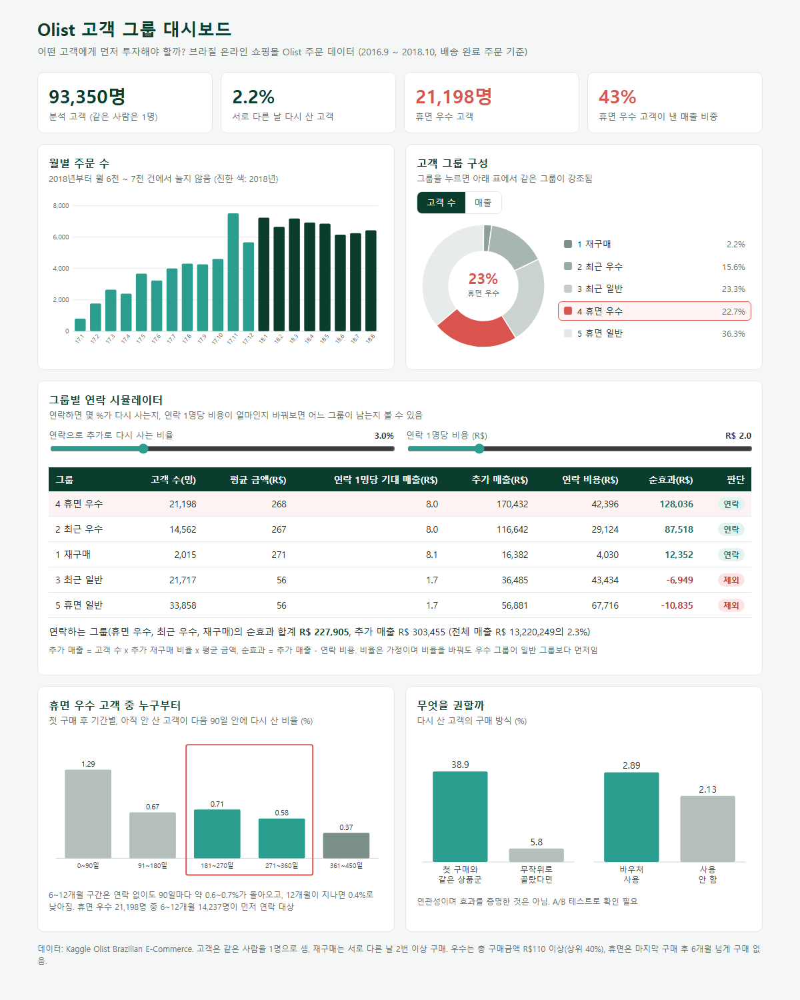
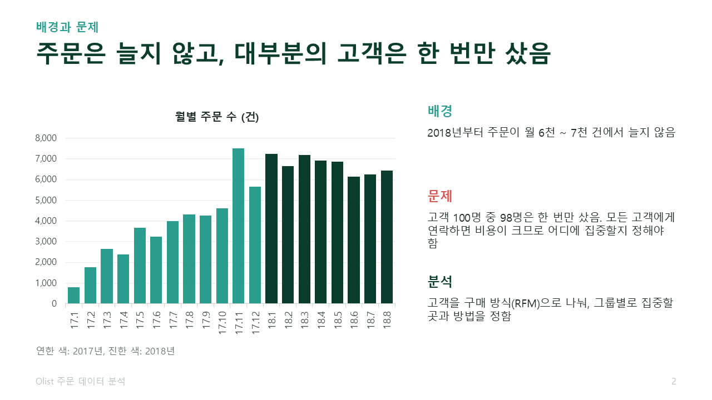
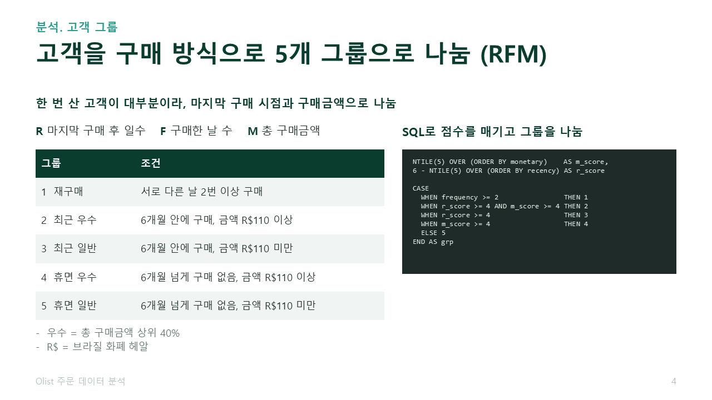
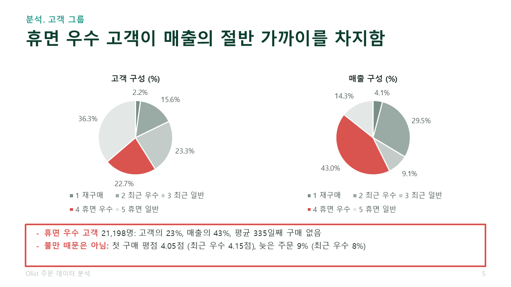
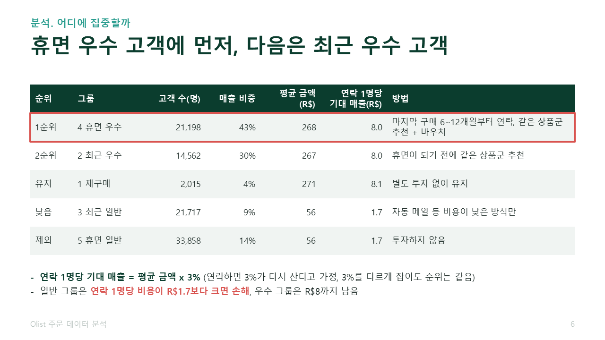
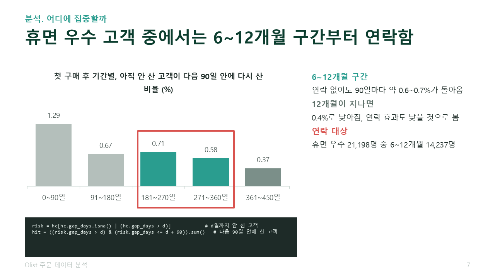
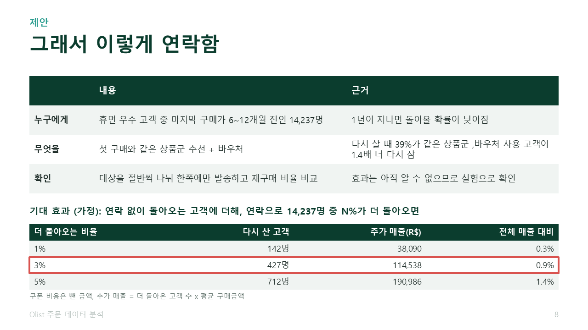

# Olist 쇼핑몰 주문 데이터 분석

어떤 고객에게 먼저 투자해야 할까? 브라질 온라인 쇼핑몰 Olist의 주문 데이터(2016.9 ~ 2018.10)를 SQL과 Python으로 분석한 프로젝트입니다.

## 화면
발표 자료: [PDF로 보기](olist_분석_포트폴리오.pdf) / [PPT 파일](olist_분석_포트폴리오.pptx)

| | | |
|---|---|---|
|  |  |  |
|  |  |  |

## 분석 흐름
1. 배경: 2018년부터 월 주문 수가 늘지 않음
2. 고객을 RFM(마지막 구매 시점, 구매한 날 수, 구매금액)으로 5개 그룹으로 나눔
3. 그룹별 매출 비중과 연락 1명당 기대 매출을 비교해 투자 우선순위를 정함
4. 휴면 우수 고객 중 마지막 구매가 6~12개월인 고객부터 연락, 같은 상품군 추천 + 바우처 제안

## 폴더 구성
| 경로 | 내용 |
|---|---|
| `analysis/sql/` | SQL (뷰, RFM 그룹, 월별 주문, 재구매 간격, 대표 상품군) |
| `analysis/run_analysis.py` | CSV를 SQLite에 넣고 SQL을 실행한 뒤 Python으로 계산, 결과를 `analysis/output/`에 저장 |
| `analysis/olist_analysis.ipynb` | 분석 과정과 결과를 한 번에 보는 노트북 |
| `analysis/build_dashboard.py`, `analysis/dashboard_template.html` | 결과를 담은 대시보드 생성 |
| `olist_dashboard.html` | 완성된 대시보드 (내려받아 브라우저에서 열면 동작) |
| `olist_분석_포트폴리오.pptx`, `.pdf` | 발표 자료 9장 |
| `analysis/build_deck.py` | 발표 자료(PPT) 생성 |

## 실행 방법
1. [Kaggle Olist 데이터](https://www.kaggle.com/datasets/olistbr/brazilian-ecommerce)를 받아 CSV를 `olist_dataset/` 폴더에 넣음
2. `pip install -r requirements.txt`
3. `python analysis/run_analysis.py` (결과 파일이 `analysis/output/`에 생김)
4. `python analysis/build_dashboard.py` (대시보드 생성), `python analysis/build_deck.py` (PPT 생성)

## 주요 결과
- 분석 대상: 취소를 뺀 배송 완료 주문 96,470건, 고객 93,350명
- 재구매 고객(서로 다른 날 2번 이상 구매)은 2.2%
- 휴면 우수 고객(6개월 넘게 구매 없음, 구매금액 R$110 이상)이 고객의 23%, 매출의 43%
- 연락 효과(추가 재구매 3%)는 가정이며, A/B 테스트로 확인이 필요함

## 데이터 출처
Kaggle, Brazilian E-Commerce Public Dataset by Olist. 이 저장소에는 원본 데이터를 포함하지 않았습니다.
